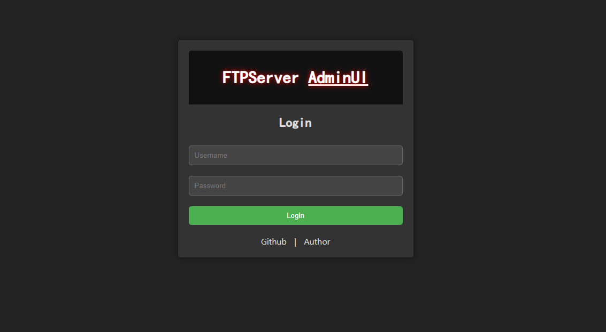

Note: This project is for personal learning only. Please use [Apache FtpServer 1.2.0 Release — Apache MINA](https://mina.apache.org/ftpserver-project/download_1_2.html) for production environment.



# Introduction

ftp-server is an FTP service implemented in Java language based on [Apache FtpServer 1.2.0 Release — Apache MINA](https://mina.apache.org/ftpserver-project/download_1_2.html).

it's very lightweight and easy to use.

# Document

download [release](https://github.com/meethigher/ftp-server/releases), then run

```sh
java -jar ftp-server.jar
```

you can configure ftp by configuring **server.properties**.

```properties
port=21
idleSeconds=60
activeLocalPort=20
passivePorts=30000-30005
anonymousLoginEnabled=true
loginFailureDelay=500
maxLogins=1000
maxAnonymousLogins=2
maxLoginFailures=3
maxThreads=0
web.enable=false
web.port=8080
web.username=admin
web.password=admin
```

you can perform user management and authorization in the users folder, the configuration file is suffixed with `.properties`

```properties
enabled=true
name=ftpadmin
password=ftpadmin
homeDir=C:/Users/meethigher/Desktop
# indicates the file path with write permission. if it is /ccc-test, it means that there is write permission under the ccc-test folder.
write=/ccc-test
maxConcurrentLogins=5
maxConcurrentLoginsPerIP=1
# bytes/second
maxDownloadRate=1024000
# bytes/second
maxUploadRate=1024000
```

